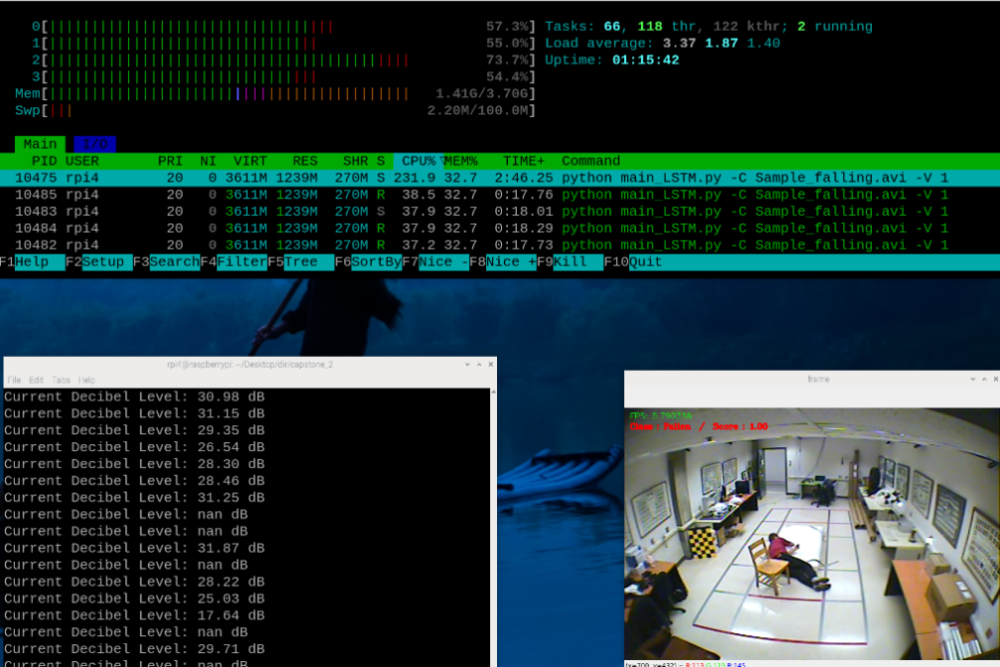

<h1> Capstone Design 2 (Sogang Univ. CSE) </h1>

Falling Detection on RaspberryPi 4

## Project Scenario


## Inference

```
git clone https://github.com/jinhaaya/Falling-Detection.git
pip install Requirements.txt

python main_LSTM.py -C 0 -V True # for main camera
python main_LSTM.py -C Sample_falling.mp4 -V True # for local video
# Option C: Video input
# Option V : Visualize the output
```


## Result


<br>
         Fallen                   non_Fallen
<br>

<br>
    alert image

## CPU


<br>



## Reference
### Dataset
- Falling
</br>- Multiple Cameras Fall Dataset : http://www.iro.umontreal.ca/~labimage/Dataset/
</br>- UR Fall Detection Dataset : http://fenix.ur.edu.pl/~mkepski/ds/uf.html
</br>- Ai Hub 시니어 이상행동 영상 : https://www.aihub.or.kr/aihubdata/data/view.do?currMenu=115&topMenu=100&aihubDataSe=data&dataSetSn=167
- nonFalling</br>- MPII Human Pose Dataset : http://human-pose.mpi-inf.mpg.de/#download
### Model
- Pose Estimation</br>- movenet/singlepose/lightning : https://tfhub.dev/google/lite-model/movenet/singlepose/lightning/tflite/int8/4
